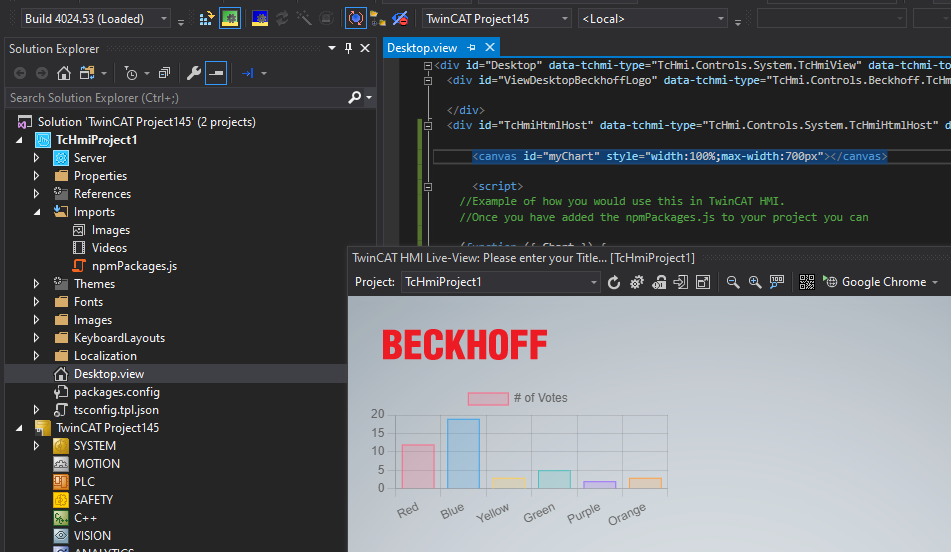

# Simple example of creating a single JavaScript file from NPM imports for use in TwinCAT HMI.

## Disclaimer

This is a personal guide not a peer reviewed journal or a sponsored publication. We make
no representations as to accuracy, completeness, correctness, suitability, or validity of any
information and will not be liable for any errors, omissions, or delays in this information or any
losses injuries, or damages arising from its display or use. All information is provided on an as
is basis. It is the reader’s responsibility to verify their own facts.

The views and opinions expressed in this guide are those of the authors and do not
necessarily reflect the official policy or position of any other agency, organization, employer or
company. Assumptions made in the analysis are not reflective of the position of any entity
other than the author(s) and, since we are critically thinking human beings, these views are
always subject to change, revision, and rethinking at any time. Please do not hold us to them
in perpetuity.

## Overview

This repository demonstrates how to integrate npm modules into a TwinCAT HMI project. Due to the current lack of direct support for npm modules in TwinCAT HMI, this guide uses webpack to bundle the modules into a format that TwinCAT HMI can understand. As an example, we'll integrate `chart.js`, a popular javascript chart.

## Prerequisites

- TwinCAT HMI environment setup
- Node.js and npm installed
- Basic understanding of JavaScript and npm package management

## Setup

1. **Clone the Repository**

   First, clone this repository to your local machine using `git clone`.

2. **Install Dependencies**

   Navigate to the cloned directory and run `npm install` to install the required dependencies.

## Using npm Modules in TwinCAT HMI

### Step 1: Adding npm Packages

In your project, you'll need to import the npm packages you intend to use. Here we use `chart.js` as an example.

```javascript
// index.js

// add your imports here
import Chart from "chart.js/auto";

// then add them to this object
const NpmPackages = {
  Chart,
};

window.NpmPackages = NpmPackages;
```

### Step 2: Building with Webpack

Use webpack to bundle your npm packages. Run the following command:

```bash
npm run build
```

This command will create a bundled JavaScript file using webpack, configured in your package.json.

### Step 3: Integrating into TwinCAT HMI

After building, add the generated JavaScript file to your TwinCAT HMI project by copying the npmPackages.js file found in the dist folder to your TwinCAT Imports folder.

Then, you can use the npm packages as follows:

Add the following code to a TcHmiHtmlHost on Desktop.view.

```html
<canvas id="myChart" style="width:100%;max-width:700px"></canvas>
<script>
  (function ({ Chart }) {
    // Use the imported modules here...

    // For instance, create a new Chart:
    var ctx = document.getElementById("myChart").getContext("2d");
    var myChart = new Chart(ctx, {
      type: "bar",
      data: {
        labels: ["Red", "Blue", "Yellow", "Green", "Purple", "Orange"],
        datasets: [
          {
            label: "# of Votes",
            data: [12, 19, 3, 5, 2, 3],
            backgroundColor: [
              "rgba(255, 99, 132, 0.2)",
              "rgba(54, 162, 235, 0.2)",
              "rgba(255, 206, 86, 0.2)",
              "rgba(75, 192, 192, 0.2)",
              "rgba(153, 102, 255, 0.2)",
              "rgba(255, 159, 64, 0.2)",
            ],
            borderColor: [
              "rgba(255, 99, 132, 1)",
              "rgba(54, 162, 235, 1)",
              "rgba(255, 206, 86, 1)",
              "rgba(75, 192, 192, 1)",
              "rgba(153, 102, 255, 1)",
              "rgba(255, 159, 64, 1)",
            ],
            borderWidth: 1,
          },
        ],
      },
      options: {
        scales: {
          y: {
            beginAtZero: true,
          },
        },
      },
    });

    // And so on...
  })(window.NpmPackages);
</script>
```

### Step 4: View in live view



## Customizing npm Packages

If you wish to use different npm packages other than `chart.js`, you can easily remove `chart.js` and add your desired packages by running the following command:

```bash
npm run change-deps
```

After running this command, chart.js will be uninstalled. You can then install any npm package you need for your project using:

```bash
npm install <your-desired-package>
```

Don't forget to update your index.js file to import and configure your new packages as needed.

## Need more help?

Please visit http://beckhoff.com/ for further guides
